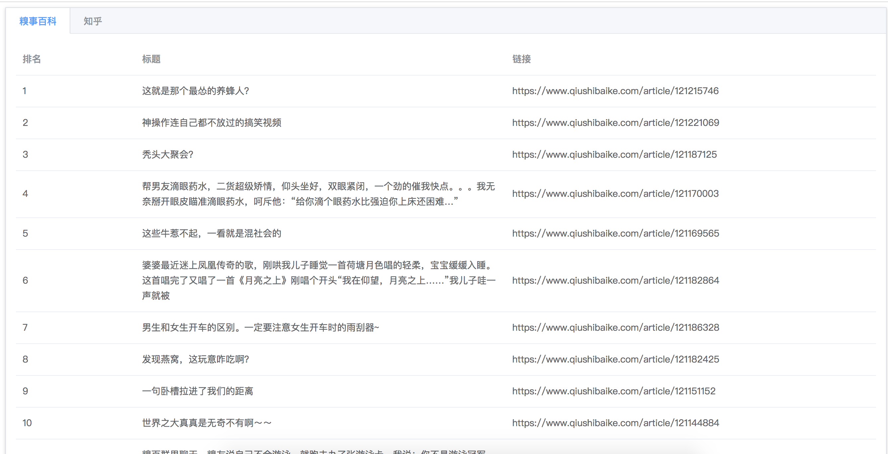

## 该repo废弃不在更新

## Toplist

## 今日热榜
> 今日热榜是一个获取各大热门网站热门头条的聚合网站，使用python语言编写，爬虫使用scripy。

## TODO
知乎hot, douban.....

## 是另外一个开源项目[TopList](https://github.com/timeromantic/TopList)的python实现
ref: 
https://github.com/timeromantic/TopList

## 快速开始
* python manage.py migrate
* python manage.py runserver
* celery -A settings worker -l info
* celery -A settings beat -l info
* django admin 添加定时任务 apps.schedule.tasks.fetch，一分钟一次
* 访问 http://localhost:8000

## 在线示例
* [在线示例](http://47.94.110.194:9001)

